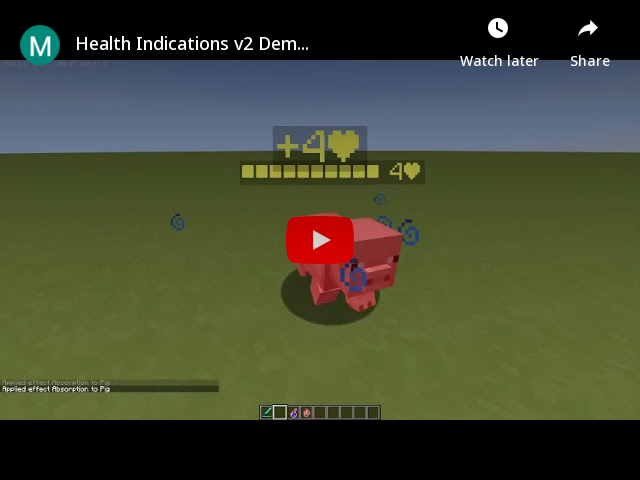
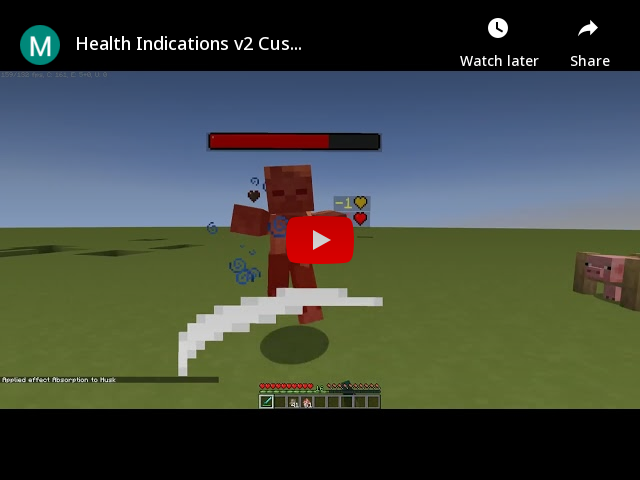
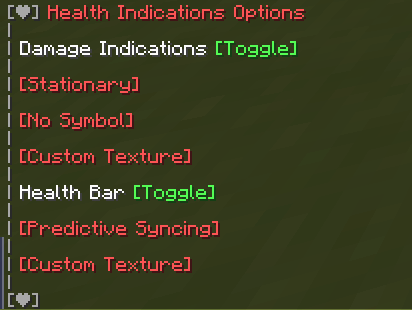

  

    <strong>See Player and Mob Health!</strong>

 

    
    

    
    &nbsp;&nbsp;
    
    &nbsp;&nbsp;
    

 

 

 

 

 

<h3>
 <strong>
 Health Bars
 </strong>
</h3>

If the entity with a health bar has the absorption effect, the absorption hearts will show up next to the health bar. Absorption is essentially a shield on one's health so it is shown separately from their main health. Their health bar is completely yellow whenever they have absorption (without the optional Resource Pack).

 

<h3>
 <strong>
 Damage Indicators
 </strong>
</h3>

Damage Indicators show up when an entity's health changes. They show up red when losing health, green when gaining health, and yellow whenever absorption hearts are added/removed. If they lose both absorption and normal hearts on one hit, two damage indicators will show- with each damage shown separately.

 

<h3>
 <strong>
 Optional Resource Pack
 </strong>
</h3>

There is an optional Resource Pack that changes how the Health Bar and Damage Indicator symbols look. The Resource Pack file is an additional file that may be downloaded with this Datapack in the Versions tab.

 

 <strong>
 <u>
  Make sure to enable the Resource Pack as well as each "Custom Texture" option in the Options Menu.
 </u>
 </strong>

 

<h3>
 <strong>
 Status Effects
 </strong>
</h3>

If you have the Resource Pack applied, you can enable Status Effects in the Options Menu. It shows current Status Effects inflicted on nearby mobs.

 

 <em>
 Left to right: Poison, Weakness, Speed, Slowness, Water Breathing
 </em>

<h4>
 <strong>
 Currently Implemented Status Effects:
 </strong>
</h4>

<ul>
 <li>Blindness</li>
 <li>Fire Resistance</li>
 <li>Haste</li>
 <li>Mining Fatigue</li>
 <li>Poison</li>
 <li>Regeneration</li>
 <li>Resistance</li>
 <li>Slowness</li>
 <li>Speed</li>
 <li>Strength</li>
 <li>Water Breathing</li>
 <li>Weakness</li>
 <li>Wither</li>
</ul>

 

<h3>
 <strong>
 Options
 </strong>
</h3>

 

You can toggle features of the pack by running the command:

 <code>
 /function #healthindications:options
 </code>

 

    
    &nbsp;&nbsp;
    

DanMizu&copy;

